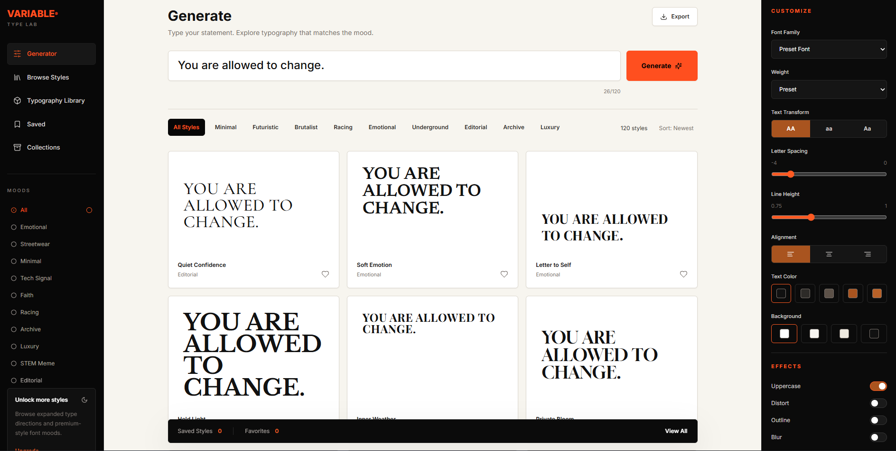
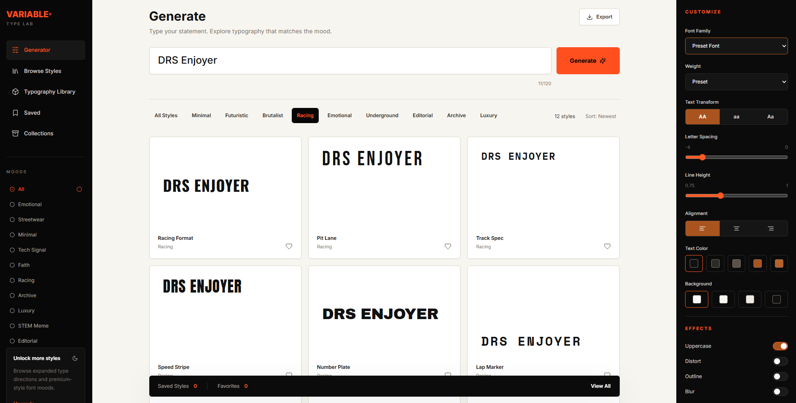

# Variable Type Lab

Variable Type Lab is a typography exploration tool designed to help creatives generate visual direction for statements, quotes, branding phrases, and emotional messaging through curated typography systems.

The project focuses on creative workflow enhancement by allowing users to instantly preview how text feels across different type moods, layouts, and stylistic treatments without manually building compositions in design software.

---

## Application Overview





---

## Overview

This project was built as a lightweight creative utility for:

- Typography experimentation
- Mood exploration
- Visual direction generation
- Branding inspiration
- Creative ideation workflows

Instead of generating AI art, the tool acts as a visual typography sandbox that helps designers and creators discover aesthetically pleasing type treatments quickly.

---

## Core Features

- Live statement preview
- Dynamic typography mood switching
- Style category filtering
- Responsive typography grid system
- Customization panel for typography controls
- Saved typography directions with local storage
- Expanded preset library with diverse font families
- Minimal creative-focused UI
- Clean visual hierarchy
- Mood-based type presentation
- Modular component architecture

---

## Design Philosophy

The interface was intentionally designed to feel:

- Minimal
- Premium
- Editorial
- Creative-tool oriented

The experience avoids the overly generic "vibe-coded" aesthetic by emphasizing:

- Refined spacing
- Strong typography hierarchy
- Subtle interactions
- Structured layouts
- Visual clarity

The UI uses:

- White primary workspace
- Dark studio-style navigation
- Neutral grayscale elements
- Muted burnt orange accents
- Soft hover transitions
- Minimal visual noise

---

## Tech Stack

### Frontend

- React
- TypeScript
- Vite

### Styling

- Tailwind CSS
- Google Fonts
- Lucide React icons
- Framer Motion

### Deployment

- Vercel

---

## Project Structure

```bash
src/
|-- components/
|   |-- AppShell.tsx
|   |-- CustomizePanel.tsx
|   |-- DetailPanel.tsx
|   |-- MoodLibrary.tsx
|   |-- MoodSelector.tsx
|   |-- SavedView.tsx
|   |-- Sidebar.tsx
|   |-- StatementInput.tsx
|   |-- TypographyCard.tsx
|   `-- TypographyGrid.tsx
|-- data/
|   `-- typographyPresets.ts
|-- types/
|   `-- typography.ts
|-- App.tsx
|-- index.css
|-- main.tsx
`-- vite-env.d.ts
```

---

## Getting Started

Install dependencies:

```bash
npm install
```

Run the development server:

```bash
npm run dev
```

Build for production:

```bash
npm run build
```

Preview the production build:

```bash
npm run preview
```

For a simple local static preview of the built `dist` folder:

```bash
npm run preview:local
```

---

## Available Scripts

```bash
npm run dev
```

Starts the Vite development server.

```bash
npm run build
```

Runs TypeScript checks and builds the production bundle.

```bash
npm run typecheck
```

Runs TypeScript project checks without creating a production bundle.

```bash
npm run preview
```

Runs Vite preview for the production build.

```bash
npm run preview:local
```

Serves the built `dist` folder with a small local Node server.

---

## Typography System

Typography presets are defined in:

```bash
src/data/typographyPresets.ts
```

Each preset includes:

- ID
- Name
- Mood
- Style category
- Font family
- Font weight
- Text transform
- Letter spacing
- Line height
- Alignment
- Layout type
- Description
- Best shirt placement

The preset system is intentionally data-driven so additional type styles, moods, and apparel direction systems can be added without restructuring the UI.

---

## Deployment

The project is Vercel-ready and includes:

```bash
vercel.json
```

The production output directory is:

```bash
dist
```

Recommended Vercel settings:

- Framework Preset: Vite
- Build Command: `npm run build`
- Output Directory: `dist`

---

## Purpose

Variable Type Lab is not an AI app. It is a creative direction tool for exploring typography taste, emotional tone, and apparel-ready statement design.
